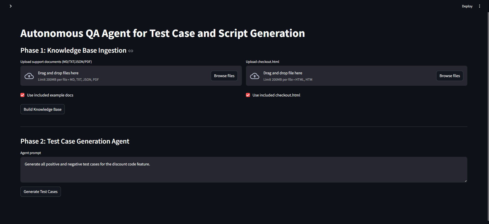

# Autonomous QA Agent for Test Case and Script Generation



The **Autonomous QA Agent** is an AI-powered system that automates the QA process by reading project documentation and a target `checkout.html` file, building a knowledge base, generating accurate test cases, and converting selected test cases into runnable Python Selenium scripts.  
This project demonstrates how AI can enhance software testing by reducing manual effort, improving accuracy, and ensuring test coverage aligned with project requirements.

---

## 📌 Overview

Traditional QA requires manually reading documentation, writing test cases, and then writing automation scripts.  
This project automates all three steps:

1. **Ingest documents + HTML**
2. **Understand them using embeddings & vector search**
3. **Generate grounded test cases**
4. **Produce Selenium scripts automatically**

The result is a powerful, end-to-end QA automation assistant.

---

## 🚀 Features

- Upload project documents (MD, TXT, JSON, PDF)
- Upload or use sample `checkout.html`
- Build a searchable knowledge base using embeddings
- RAG-based (Retrieval-Augmented Generation) test case creation
- Strict grounding in provided documents (no hallucinated features)
- Auto-generate runnable Python Selenium scripts
- Simple and intuitive Streamlit UI
- Optional FastAPI backend for modular architecture

---

## 🧠 Tech Stack

| Component | Technology |
|----------|------------|
| UI | Streamlit |
| Backend | FastAPI |
| Vector DB | ChromaDB |
| Embeddings | SentenceTransformers (`all-MiniLM-L6-v2`) |
| Parsers | BeautifulSoup4, PyMuPDF, JSON/MD/TXT readers |
| LLM Provider | Ollama / Local Models |
| Automation | Selenium (Python) |

---

## Project Structure
```
assets/
  checkout.html
backend/
  app.py
docs/
  product_specs.md
  ui_ux_guide.txt
  api_endpoints.json
qa_agent/
  __init__.py
  knowledge_base.py
  parser.py
  vectorstore.py
  llm.py
  agent.py
  script_generator.py
ui/
  streamlit_app.py
requirements.txt
README.md
```

## Setup
- Python: 3.10+ recommended

### 1) Create virtual environment (Windows PowerShell)
```
python -m venv .venv
.\.venv\Scripts\Activate.ps1
pip install -r requirements.txt
```

### 2) Optional: Configure LLM provider
- Ollama: install Ollama and ensure a model is available (e.g., `llama3`, `qwen2.5`) and server is running on `http://localhost:11434`.
- If no LLM is available, the app falls back to a deterministic template generator.

## Running

### Streamlit UI (recommended for demo)
```
streamlit run ui/streamlit_app.py
```

### FastAPI Backend (optional)
```
uvicorn backend.app:app --reload --port 8000
```

## Usage
1. Open the Streamlit app.
2. Upload 3–5 support documents (or use the included examples).
3. Upload or paste the provided `checkout.html` (or use the included example).
4. Click "Build Knowledge Base" to ingest documents and HTML.
5. In the Agent section, enter a request (e.g., "Generate all positive and negative test cases for the discount code feature.")
6. Review generated test cases with clear grounding references.
7. Select a test case and click "Generate Selenium Script" to download a runnable Python script.

## Included Support Documents
- `product_specs.md`
  - Contains feature rules (e.g., SAVE15 applies 15% discount, shipping costs)
- `ui_ux_guide.txt`
  - Provides UI/UX guidelines (colors, validation behavior)
- `api_endpoints.json`
  - Example endpoints for coupon and order submission

## Notes
- All test reasoning is grounded strictly in the provided documents. The agent includes document citations for each test case.
- The generated Selenium scripts use IDs and selectors present in the provided `checkout.html`.
- If you use your own `checkout.html`, ensure elements have stable attributes (IDs/names) for reliable selectors.
